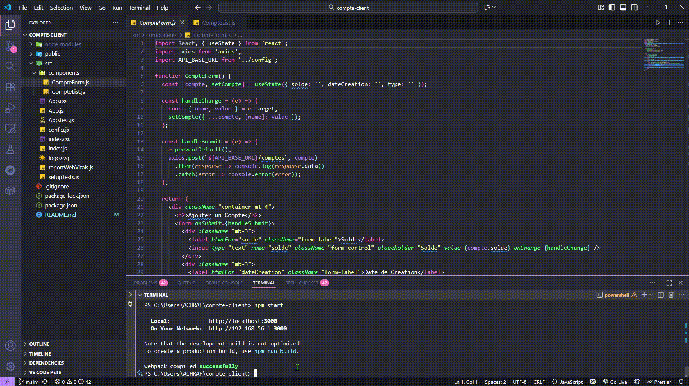

# Compte Client - Application de Gestion de Comptes Bancaires

Application React pour la gestion de comptes bancaires (Courant et Épargne). Cette application permet d'ajouter et de visualiser des comptes via une interface utilisateur moderne utilisant Bootstrap.



## Fonctionnalités

- ✨ Ajouter un nouveau compte bancaire
- 📋 Afficher la liste de tous les comptes
- 💰 Gestion de deux types de comptes : Courant et Épargne
- 🔄 Communication avec une API REST backend

## Technologies Utilisées

- **React** (v19.2.0) - Bibliothèque JavaScript pour l'interface utilisateur
- **Bootstrap** (v5.3.8) - Framework CSS pour le design responsive
- **Axios** (v1.12.2) - Client HTTP pour les appels API
- **React Testing Library** - Tests unitaires

## Prérequis

- Node.js (version 14 ou supérieure)
- npm ou yarn
- Backend API en cours d'exécution sur `http://localhost:8082/api`

## Démarrage de l'Application

In the project directory, you can run:

### `npm start`

## Structure du Projet

```
compte-client/
├── public/           # Fichiers statiques
├── src/
│   ├── components/
│   │   ├── CompteForm.js   # Formulaire d'ajout de compte
│   │   └── CompteList.js   # Liste des comptes
│   ├── App.js        # Composant principal
│   ├── config.js     # Configuration de l'URL de l'API
│   └── index.js      # Point d'entrée de l'application
└── package.json
```

```

## Types de Comptes

- **COURANT** - Compte courant
- **EPARGNE** - Compte épargne

## Auteur

ACHRAF
```
